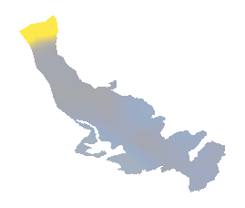
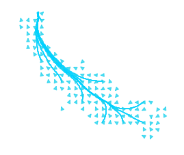
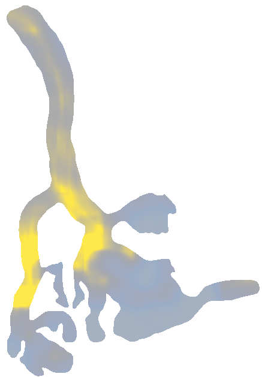
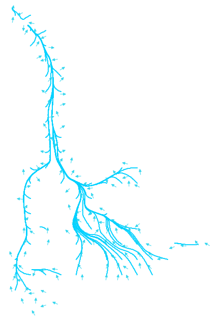

# Glacier Depth SIA Model

Glacier depth estimation and visualization pipeline using a shallow-ice approximation (SIA) style workflow:
outline -> DEM -> slope -> flowlines -> depth -> report bundle.

Core app code lives in `workspace/glacier_app/` (Flask UI + CLI + tests).

## Quick Start

```bash
cd workspace/glacier_app
python -m venv .venv
source .venv/bin/activate
pip install -r requirements.txt
cp config.example.yaml config.yaml
glacier-cli --config config.yaml
```

For API/UI usage and endpoint examples, see `workspace/glacier_app/README.md`.

## Key Figures (Real DEM Runs, No Synthetic Fallback)

The figures below are from completed jobs where:
- `dem_source = opentopography`
- `dem_fallback = false`

These are selected named glaciers from `workspace/glacier_app/outputs/*/report.json` generated on March 3-4, 2026 (UTC).

| Glacier | Job ID | DEM Dataset | Resolution (m) | Mean Slope (deg) | Mean Depth (m) | Flowlines |
|---|---|---:|---:|---:|---:|---:|
| Grenzgletscher | `job_20260303_160059_d5e799a4` | OpenTopography | 30 | 19.718 | 437.284 | 11 |
| Herron Glacier | `job_20260303_162343_1372a3aa` | COP30 via OpenTopography API | 30 | 17.543 | 3.791 | 65 |
| Hotlum Glacier | `job_20260303_071850_af53cc8f` | OpenTopography | 30 | 26.838 | 223.647 | 1 |

## Topography Overlay Figures

| Glacier | Topo Depth Overlay | Topo Flow Overlay |
|---|---|---|
| Grenzgletscher |  |  |
| Herron Glacier |  |  |
| Hotlum Glacier |  |  |

## Notes

- Output/job artifacts are intentionally git-ignored (see `.gitignore`) to keep releases lightweight.
- Mean depth values are model outputs and depend on parameters like `tau_f`, resolution, and outline quality.
- For reproducibility, keep the `job_id`, `config.yaml`, and `report.json` together for each run.
